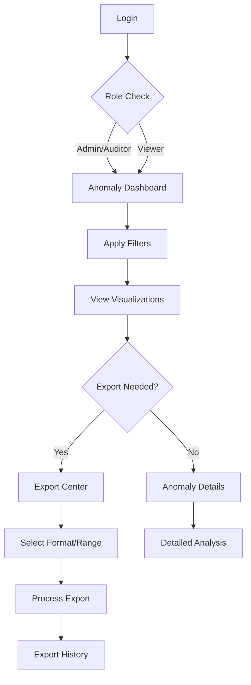

## 1. Product Overview

Comprehensive anomaly management system for admin reports with advanced visualization, filtering, and export capabilities. This enhancement provides auditors and administrators with powerful tools to detect, analyze, and export anomaly data efficiently.

The system addresses the need for real-time anomaly detection visualization, streamlined export workflows, and improved data accessibility for compliance and auditing purposes.

## 2. Core Features

### 2.1 User Roles

| Role       | Registration Method             | Core Permissions                                                                |
| ---------- | ------------------------------- | ------------------------------------------------------------------------------- |
| Admin User | System administrator assignment | Full access to all anomaly data, export functionality, and system configuration |
| Auditor    | Admin invitation/approval       | View anomaly data, export reports, access historical data                       |
| Viewer     | Admin assignment                | Read-only access to anomaly dashboards and basic filtering                      |

### 2.2 Feature Module

Anomaly Management System consists of the following main pages:

1. **Anomaly Dashboard**: Interactive visualization panels, real-time anomaly detection, severity indicators
2. **Export Center**: Auditor export panel, format selection, export history tracking
3. **Anomaly Details**: Detailed anomaly information, historical trends, related incidents

### 2.3 Page Details

| Page Name         | Module Name          | Feature description                                                                                                      |
| ----------------- | -------------------- | ------------------------------------------------------------------------------------------------------------------------ |
| Anomaly Dashboard | Visualization Panel  | Display interactive charts showing anomaly trends, severity distribution, and category breakdowns with real-time updates |
| Anomaly Dashboard | Severity Indicators  | Implement color-coded visual indicators (red for critical, orange for warning, blue for info) with hover tooltips        |
| Anomaly Dashboard | Filter Controls      | Provide timestamp range selectors, anomaly category dropdowns, and severity level filters with instant results           |
| Anomaly Dashboard | Data Table           | Show tabular view of anomalies with sortable columns, pagination, and quick actions                                      |
| Export Center     | Export Module        | Create format selection interface supporting CSV, JSON, and PDF exports with preview functionality                       |
| Export Center     | Date Range Selector  | Implement intuitive calendar widgets for selecting export date ranges with preset options                                |
| Export Center     | Anomaly Type Filters | Provide multi-select checkboxes for filtering specific anomaly categories before export                                  |
| Export Center     | Export History       | Display table of previous exports with status indicators, timestamps, and download links                                 |
| Export Center     | Access Controls      | Implement role-based permissions showing/hiding export options based on user privileges                                  |
| Anomaly Details   | Detail View          | Show comprehensive anomaly information including detection time, severity, category, and description                     |
| Anomaly Details   | Historical Trends    | Display timeline chart showing related anomalies and pattern analysis                                                    |
| Anomaly Details   | Related Incidents    | List connected incidents or similar anomalies for correlation analysis                                                   |

## 3. Core Process

**Admin/Auditor Flow:**

1. User navigates to Anomaly Dashboard from main navigation
2. System loads default anomaly visualization with last 24 hours of data
3. User applies filters (timestamp, category, severity) to refine view
4. Interactive charts update in real-time based on filter selections
5. User can drill down into specific anomalies for detailed analysis
6. For exports, user navigates to Export Center
7. User selects desired format, date range, and anomaly types
8. System processes export request and shows progress indicator
9. Completed export appears in history with download option

**Viewer Flow:**

1. User accesses Anomaly Dashboard with read-only permissions
2. Can view all visualizations and apply filters
3. Cannot access export functionality or detailed configuration

## 4. User Interface Design

### 4.1 Design Style

* **Primary Colors**: Deep blue (#1E40AF) for headers, white (#FFFFFF) for backgrounds

* **Severity Colors**: Critical red (#DC2626), Warning orange (#F59E0B), Info blue (#3B82F6)

* **Button Style**: Rounded corners (8px radius), subtle shadows, hover animations

* **Typography**: Inter font family, 16px base size, clear hierarchy with proper font weights

* **Layout**: Card-based design with consistent spacing (24px grid system)

* **Icons**: Feather icons for consistency, with appropriate ARIA labels

### 4.2 Page Design Overview

| Page Name         | Module Name         | UI Elements                                                                                             |
| ----------------- | ------------------- | ------------------------------------------------------------------------------------------------------- |
| Anomaly Dashboard | Visualization Panel | Full-width responsive charts using Chart.js, dark mode support, smooth animations, interactive tooltips |
| Anomaly Dashboard | Severity Indicators | Circular badges with icons, positioned at chart data points, pulsing animation for critical items       |
| Anomaly Dashboard | Filter Controls     | Inline filter bar with date pickers, dropdown menus, and toggle buttons, sticky positioning on scroll   |
| Export Center     | Export Module       | Modal-based interface with format cards, progress bars, and success animations                          |
| Export Center     | Export History      | Data table with status badges, action buttons, and infinite scroll for large histories                  |

### 4.3 Responsiveness

* Desktop-first design with mobile adaptation

* Breakpoints: 640px (mobile), 768px (tablet), 1024px (desktop)

* Touch-optimized controls for mobile devices

* Responsive charts that adapt to screen size

* Collapsible navigation for smaller screens

### 4.4 Accessibility Features

* ARIA labels on all interactive elements

* Keyboard navigation support with clear focus indicators

* Screen reader announcements for dynamic content updates

* High contrast mode support

* Minimum touch target size of 44px for mobile devices

