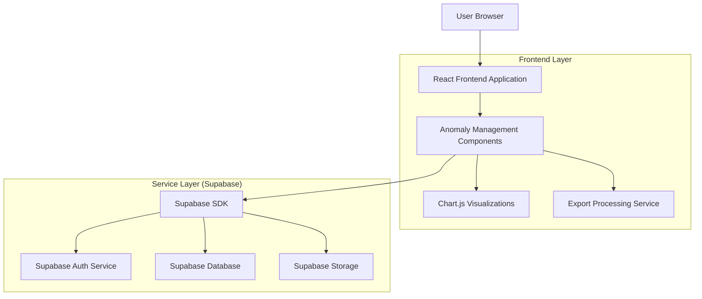
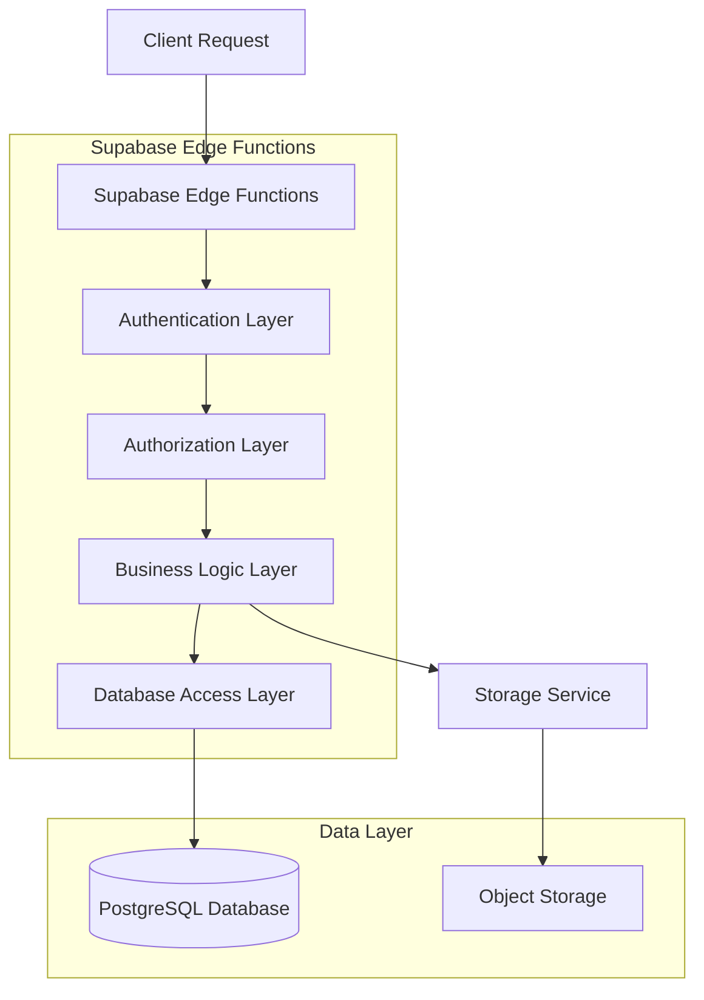
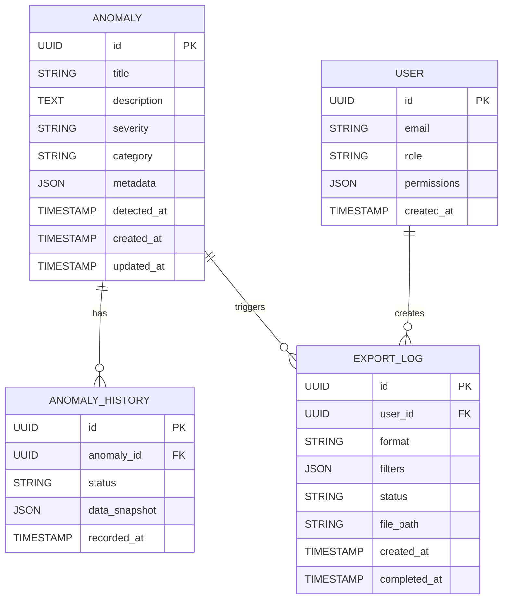

## 1. Architecture Design



## 2. Technology Description

- **Frontend**: React@18 + Chart.js@4 + TailwindCSS@3 + Vite
- **Initialization Tool**: vite-init
- **Backend**: Supabase (Auth, Database, Storage)
- **Visualization**: Chart.js for interactive charts, D3.js for custom visualizations
- **Export Libraries**: jsPDF for PDF generation, PapaParse for CSV processing

## 3. Route Definitions

| Route | Purpose |
|-------|---------|
| /admin/anomalies | Main anomaly dashboard with visualization panels |
| /admin/anomalies/export | Export center for generating reports |
| /admin/anomalies/:id | Detailed view of specific anomaly |
| /admin/anomalies/history | Export history and status tracking |

## 4. API Definitions

### 4.1 Anomaly Data APIs

**Get Anomaly List**
```
GET /api/anomalies
```

Request Parameters:
| Param Name | Param Type | isRequired | Description |
|------------|------------|------------|-------------|
| start_date | string | false | Start date in ISO format |
| end_date | string | false | End date in ISO format |
| severity | string | false | Filter by severity (critical/warning/info) |
| category | string | false | Filter by anomaly category |
| limit | number | false | Number of results (default: 50) |
| offset | number | false | Pagination offset |

Response:
| Param Name | Param Type | Description |
|------------|-------------|-------------|
| anomalies | array | Array of anomaly objects |
| total_count | number | Total number of anomalies |
| filtered_count | number | Number of anomalies after filtering |

**Export Anomalies**
```
POST /api/anomalies/export
```

Request:
| Param Name | Param Type | isRequired | Description |
|------------|------------|------------|-------------|
| format | string | true | Export format (csv/json/pdf) |
| start_date | string | true | Export start date |
| end_date | string | true | Export end date |
| severity | array | false | Array of severity levels to include |
| category | array | false | Array of categories to include |

Response:
| Param Name | Param Type | Description |
|------------|-------------|-------------|
| export_id | string | Unique export identifier |
| status | string | Export status (processing/completed/failed) |
| download_url | string | URL to download exported file |

## 5. Server Architecture Diagram



## 6. Data Model

### 6.1 Data Model Definition



### 6.2 Data Definition Language

**Anomalies Table**
```sql
-- Create anomalies table
CREATE TABLE anomalies (
    id UUID PRIMARY KEY DEFAULT gen_random_uuid(),
    title VARCHAR(255) NOT NULL,
    description TEXT,
    severity VARCHAR(20) CHECK (severity IN ('critical', 'warning', 'info')),
    category VARCHAR(100),
    metadata JSONB DEFAULT '{}',
    detected_at TIMESTAMP WITH TIME ZONE DEFAULT NOW(),
    created_at TIMESTAMP WITH TIME ZONE DEFAULT NOW(),
    updated_at TIMESTAMP WITH TIME ZONE DEFAULT NOW()
);

-- Create indexes
CREATE INDEX idx_anomalies_severity ON anomalies(severity);
CREATE INDEX idx_anomalies_category ON anomalies(category);
CREATE INDEX idx_anomalies_detected_at ON anomalies(detected_at DESC);
CREATE INDEX idx_anomalies_created_at ON anomalies(created_at DESC);

-- Grant permissions
GRANT SELECT ON anomalies TO anon;
GRANT ALL PRIVILEGES ON anomalies TO authenticated;
```

**Export Logs Table**
```sql
-- Create export logs table
CREATE TABLE export_logs (
    id UUID PRIMARY KEY DEFAULT gen_random_uuid(),
    user_id UUID REFERENCES auth.users(id),
    format VARCHAR(10) CHECK (format IN ('csv', 'json', 'pdf')),
    filters JSONB DEFAULT '{}',
    status VARCHAR(20) CHECK (status IN ('processing', 'completed', 'failed')),
    file_path TEXT,
    created_at TIMESTAMP WITH TIME ZONE DEFAULT NOW(),
    completed_at TIMESTAMP WITH TIME ZONE
);

-- Create indexes
CREATE INDEX idx_export_logs_user_id ON export_logs(user_id);
CREATE INDEX idx_export_logs_status ON export_logs(status);
CREATE INDEX idx_export_logs_created_at ON export_logs(created_at DESC);

-- Grant permissions
GRANT SELECT ON export_logs TO authenticated;
```

**Row Level Security Policies**
```sql
-- Enable RLS
ALTER TABLE anomalies ENABLE ROW LEVEL SECURITY;
ALTER TABLE export_logs ENABLE ROW LEVEL SECURITY;

-- Anomalies policies
CREATE POLICY "Anomalies are viewable by authenticated users" ON anomalies
    FOR SELECT TO authenticated USING (true);

CREATE POLICY "Anomalies can be managed by admin users" ON anomalies
    FOR ALL TO authenticated USING (
        EXISTS (
            SELECT 1 FROM auth.users
            WHERE auth.users.id = auth.uid()
            AND auth.users.raw_user_meta_data->>'role' = 'admin'
        )
    );

-- Export logs policies
CREATE POLICY "Users can view their own export logs" ON export_logs
    FOR SELECT TO authenticated USING (auth.uid() = user_id);

CREATE POLICY "Admin users can view all export logs" ON export_logs
    FOR SELECT TO authenticated USING (
        EXISTS (
            SELECT 1 FROM auth.users
            WHERE auth.users.id = auth.uid()
            AND auth.users.raw_user_meta_data->>'role' = 'admin'
        )
    );
```

## 7. Component Architecture

### 7.1 React Component Structure
```
src/
├── components/
│   ├── anomaly-dashboard/
│   │   ├── AnomalyChart.tsx
│   │   ├── SeverityIndicator.tsx
│   │   ├── FilterControls.tsx
│   │   └── AnomalyTable.tsx
│   ├── export-center/
│   │   ├── ExportModal.tsx
│   │   ├── FormatSelector.tsx
│   │   ├── DateRangePicker.tsx
│   │   └── ExportHistory.tsx
│   └── shared/
│       ├── LoadingSpinner.tsx
│       ├── ErrorBoundary.tsx
│       └── AccessibilityWrapper.tsx
├── hooks/
│   ├── useAnomalyData.ts
│   ├── useExportManager.ts
│   └── useAccessibility.ts
└── utils/
    ├── exportHelpers.ts
    ├── chartConfig.ts
    └── accessibilityUtils.ts
```

## 8. Testing Strategy

### 8.1 Unit Testing
- Jest + React Testing Library for component testing
- Coverage targets: 80% for critical components
- Mock Supabase client for API testing
- Accessibility testing with jest-axe

### 8.2 Integration Testing
- Test anomaly data flow from Supabase to UI
- Verify export functionality end-to-end
- Test role-based access controls
- Performance testing for large datasets

### 8.3 Accessibility Testing
- Automated testing with axe-core
- Manual keyboard navigation testing
- Screen reader compatibility testing
- Color contrast validation