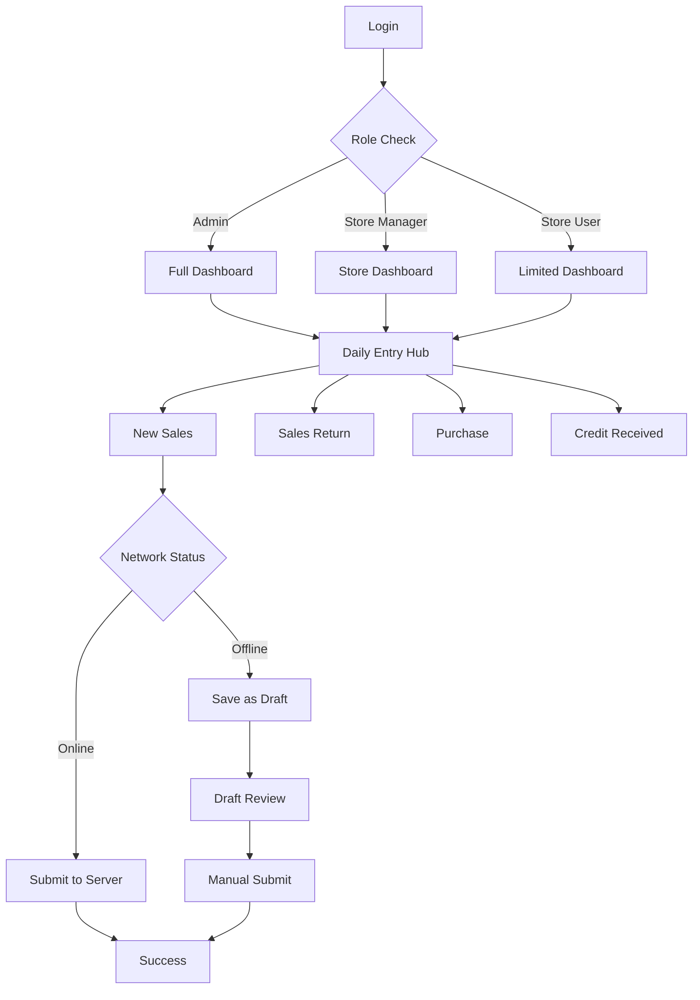

## 1. Product Overview
Sahakar Accounts is a comprehensive sales management system designed to replace Google Sheets data collection with a robust, offline-capable PWA solution. The system enables store staff to manage sales entries, track customers with mandatory referral tracking, and maintain accounting integrity through role-based permissions and offline draft management.

The product solves critical accounting data integrity issues by preventing offline writes while providing seamless user experience through draft management, ensuring no data loss during network interruptions while maintaining strict accounting standards.

## 2. Core Features

### 2.1 User Roles
| Role | Registration Method | Core Permissions |
|------|---------------------|------------------|
| Admin | Admin creation only | Full CRUD permissions, export customers database (PDF/Excel/CSV), manage all settings |
| Store Manager | Admin creation | Full CRUD for store functions, view customers referred by staff, manage store operations |
| Store User | Admin/Manager creation | Add new entries and customers only, no edit/delete permissions |

### 2.2 Feature Module
Our sales management system consists of the following main pages:
1. **Dashboard**: Role-based charts and data visualization showing accessible information
2. **New Sales**: Sales entry form with payment modes, customer lookup, and validation
3. **Daily Entry Hub**: Four-section entry portal (New Sales, Sales Return, Purchase, Credit Received)
4. **Customer Management**: Add customer form with mandatory referred-by field and phone validation
5. **Draft Review**: Offline draft management and submission interface
6. **Export Center**: Database export functionality for admin roles

### 2.3 Page Details
| Page Name | Module Name | Feature description |
|-----------|-------------|---------------------|
| Dashboard | Charts Section | Display user-friendly charts and data based on role permissions and accessible information |
| Dashboard | Quick Stats | Show key metrics like total sales, pending drafts, recent transactions |
| New Sales | Customer Lookup | Auto-populate customer data by phone number, create new customer if not found |
| New Sales | Payment Modes | Smart payment distribution with auto-fill for single mode, separate fields for multiple modes |
| New Sales | Validation | Mandatory fields validation, phone format validation, numeric-only amount fields |
| Daily Entry Hub | Navigation | Four-section portal with New Sales, Sales Return, Purchase, Credit Received options |
| Sales Return | Entry Form | Customer phone, name, cash amount, UPI amount, entry/bill number fields |
| Purchase | Entry Form | Particulars, voucher number, cash/UPI/credit amounts, invoice number fields |
| Credit Received | Entry Form | Customer phone, name, cash/UPI amounts, entry/bill number fields |
| Customer Management | Add Customer | Required fields: Name, Phone (validated and unique), mandatory referred-by staff selection |
| Draft Review | Draft List | Display all offline drafts with transaction type, amount, creation time |
| Draft Review | Draft Actions | Edit draft, submit draft individually, bulk submit all drafts, delete draft |
| Export Center | Format Selection | Choose export format (PDF/Excel/CSV) for customers database filtered by referrals |

## 3. Core Process

### Admin Flow
Admin users can access all system functions including customer exports and full CRUD operations across all modules. They can view comprehensive dashboards with all store data and manage user roles.

### Store Manager Flow
Store Managers have full operational control over their store's data entry and can view customers referred by their staff members. They can access all daily entry sections and manage customer information.

### Store User Flow
Store Users are limited to adding new sales entries and customers only. They cannot edit or delete existing records and have restricted dashboard visibility based on their permissions.

### Universal Process Flow

## 4. User Interface Design

### 4.1 Design Style
- **Primary Colors**: Professional blue (#2563eb) for primary actions, green (#059669) for success states
- **Secondary Colors**: Gray scale for neutral elements, red (#dc2626) for errors and warnings
- **Button Style**: Rounded corners with clear hover states, primary actions prominently displayed
- **Font**: Clean, readable sans-serif (Inter or similar) with hierarchy: Headers 18-24px, Body 14-16px
- **Layout Style**: Card-based design with consistent spacing, responsive grid system
- **Icons**: Material Design icons for consistency and recognition

### 4.2 Page Design Overview
| Page Name | Module Name | UI Elements |
|-----------|-------------|-------------|
| Dashboard | Charts Section | Responsive charts using Chart.js, color-coded data visualization, mobile-optimized touch targets |
| New Sales | Payment Modes | Dynamic form sections that appear/disappear based on selection, real-time amount validation |
| Daily Entry Hub | Navigation Cards | Large, touch-friendly cards with icons, clear section separation, mobile-first responsive grid |
| Customer Management | Add Form | Clean form layout with phone validation feedback, staff dropdown for referred-by field |
| Draft Review | Draft Cards | Card-based draft display with action buttons, status indicators, bulk action toolbar |

### 4.3 Responsiveness
- **Desktop-First Design**: Optimized for desktop use with tablet and mobile adaptations
- **Touch Interaction**: All interactive elements sized for touch targets (minimum 44px)
- **Progressive Web App**: Installable on all devices with offline capability for draft management
- **Universal Access**: Consistent experience across phones, tablets, and computers

### 4.4 Offline Experience Design
- **Network Status Indicator**: Persistent banner showing online/offline status
- **Draft Mode Visual**: Clear visual indicators when working in offline draft mode
- **Submission Warnings**: Strong visual warnings for unsaved drafts with red banners
- **Progressive Enhancement**: Core functionality works offline with enhanced features when online