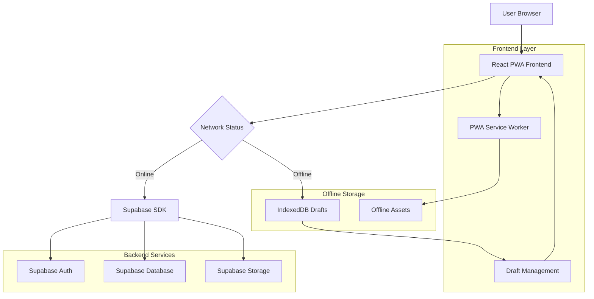
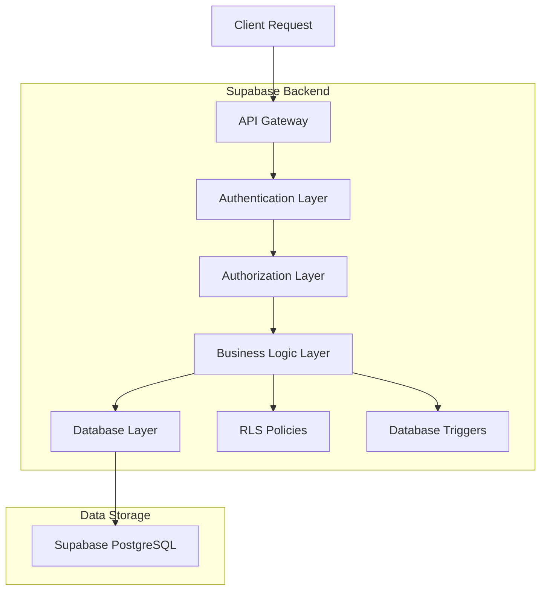
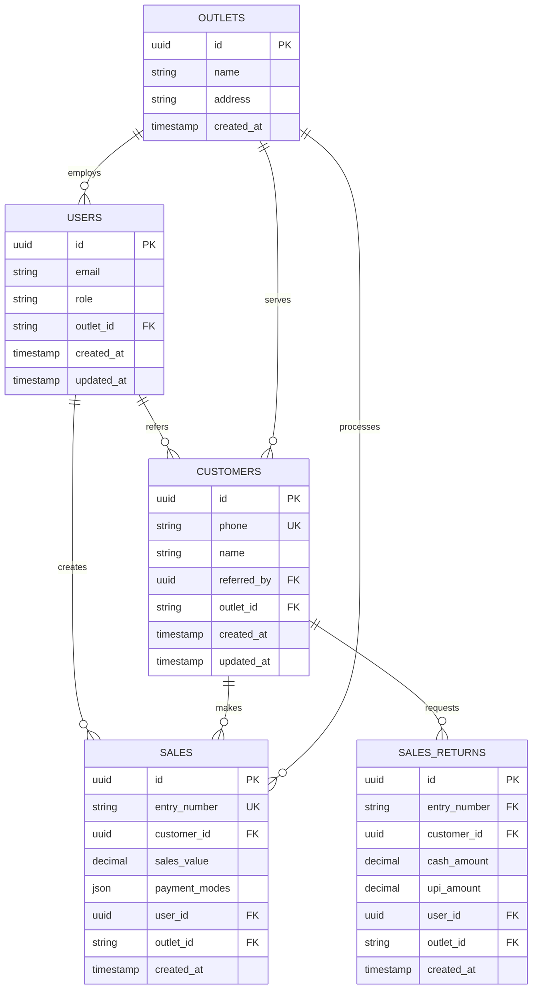

## 1. Architecture Design



## 2. Technology Description

* **Frontend**: React\@18 + TypeScript + TailwindCSS\@3 + Vite

* **Initialization Tool**: vite-init

* **Database**: Supabase (PostgreSQL)

* **Authentication**: Supabase Auth

* **Offline Storage**: IndexedDB via idb library

* **PWA**: Workbox for service worker

* **UI Components**: HeadlessUI + Radix UI

* **Forms**: React Hook Form + Zod validation

* **Charts**: Chart.js + React Chart.js 2

* **Notifications**: Sonner for toast notifications

* **State Management**: React Query + Context API

## 3. Route Definitions

| Route            | Purpose                                      |
| ---------------- | -------------------------------------------- |
| /                | Dashboard with role-based data visualization |
| /login           | Authentication page with Supabase auth       |
| /daily-entries   | Hub for all daily entry sections             |
| /sales/new       | New sales entry form with payment modes      |
| /sales/return    | Sales return entry form                      |
| /purchase/new    | Purchase entry form                          |
| /credit/received | Credit amount received entry form            |
| /customers       | Customer management and listing              |
| /customers/add   | Add new customer form with referral tracking |
| /drafts          | Offline draft review and management          |
| /export          | Export center for admin roles                |
| /profile         | User profile and settings                    |

## 4. API Definitions

### 4.1 Authentication APIs

**Login**

```
POST /auth/v1/token?grant_type=password
```

Request:

| Param Name | Param Type | isRequired | Description        |
| ---------- | ---------- | ---------- | ------------------ |
| email      | string     | true       | User email address |
| password   | string     | true       | User password      |

### 4.2 Sales Entry APIs

**Create New Sale**

```
POST /rest/v1/sales
```

Request:

| Param Name      | Param Type | isRequired | Description                    |
| --------------- | ---------- | ---------- | ------------------------------ |
| customer\_phone | string     | true       | Customer phone number          |
| customer\_name  | string     | true       | Customer name                  |
| entry\_number   | string     | true       | Unique bill/entry number       |
| sales\_value    | number     | true       | Total sales amount             |
| payment\_modes  | array      | true       | Array of payment mode objects  |
| referred\_by    | string     | true       | Staff ID who referred customer |
| outlet\_id      | string     | true       | Store outlet identifier        |

**Create Sales Return**

```
POST /rest/v1/sales_returns
```

Request:

| Param Name      | Param Type | isRequired | Description                |
| --------------- | ---------- | ---------- | -------------------------- |
| customer\_phone | string     | true       | Customer phone number      |
| customer\_name  | string     | true       | Customer name              |
| entry\_number   | string     | true       | Original bill/entry number |
| cash\_amount    | number     | false      | Cash return amount         |
| upi\_amount     | number     | false      | UPI return amount          |

### 4.3 Customer Management APIs

**Create Customer**

```
POST /rest/v1/customers
```

Request:

| Param Name   | Param Type | isRequired | Description                    |
| ------------ | ---------- | ---------- | ------------------------------ |
| phone        | string     | true       | Customer phone number (unique) |
| name         | string     | true       | Customer name                  |
| referred\_by | string     | true       | Staff ID who referred customer |
| outlet\_id   | string     | true       | Store outlet identifier        |

**Get Customer by Phone**

```
GET /rest/v1/customers?phone=eq.{phone}
```

### 4.4 Export APIs

**Export Customers**

```
GET /rest/v1/customers_export
```

Query Parameters:

| Param Name   | Param Type | isRequired | Description                    |
| ------------ | ---------- | ---------- | ------------------------------ |
| format       | string     | true       | Export format: pdf, excel, csv |
| referred\_by | string     | false      | Filter by referring staff      |
| outlet\_id   | string     | false      | Filter by outlet               |

## 5. Server Architecture Diagram



## 6. Data Model

### 6.1 Entity Relationship Diagram



### 6.2 Data Definition Language

**Users Table**

```sql
-- Create users table (extends Supabase auth.users)
CREATE TABLE users (
    id UUID PRIMARY KEY DEFAULT gen_random_uuid(),
    email VARCHAR(255) UNIQUE NOT NULL,
    role VARCHAR(50) NOT NULL CHECK (role IN ('admin', 'store_manager', 'store_user')),
    outlet_id UUID REFERENCES outlets(id),
    created_at TIMESTAMP WITH TIME ZONE DEFAULT NOW(),
    updated_at TIMESTAMP WITH TIME ZONE DEFAULT NOW()
);

-- Create index
CREATE INDEX idx_users_outlet_id ON users(outlet_id);
CREATE INDEX idx_users_role ON users(role);

-- RLS Policies
ALTER TABLE users ENABLE ROW LEVEL SECURITY;

-- Admin can see all users
CREATE POLICY "Admin full access" ON users
    FOR ALL TO authenticated
    USING (auth.uid() IN (SELECT id FROM users WHERE role = 'admin'));

-- Store managers can see their outlet users
CREATE POLICY "Store manager outlet access" ON users
    FOR SELECT TO authenticated
    USING (outlet_id = (SELECT outlet_id FROM users WHERE id = auth.uid()));
```

**Customers Table**

```sql
-- Create customers table
CREATE TABLE customers (
    id UUID PRIMARY KEY DEFAULT gen_random_uuid(),
    phone VARCHAR(20) UNIQUE NOT NULL,
    name VARCHAR(100) NOT NULL,
    referred_by UUID NOT NULL REFERENCES users(id),
    outlet_id UUID NOT NULL REFERENCES outlets(id),
    created_at TIMESTAMP WITH TIME ZONE DEFAULT NOW(),
    updated_at TIMESTAMP WITH TIME ZONE DEFAULT NOW()
);

-- Create indexes
CREATE INDEX idx_customers_phone ON customers(phone);
CREATE INDEX idx_customers_referred_by ON customers(referred_by);
CREATE INDEX idx_customers_outlet_id ON customers(outlet_id);

-- RLS Policies
ALTER TABLE customers ENABLE ROW LEVEL SECURITY;

-- Basic read access for anon
CREATE POLICY "Anon read access" ON customers
    FOR SELECT TO anon
    USING (true);

-- Full access for authenticated users
CREATE POLICY "Authenticated full access" ON customers
    FOR ALL TO authenticated
    USING (true);
```

**Sales Table**

```sql
-- Create sales table
CREATE TABLE sales (
    id UUID PRIMARY KEY DEFAULT gen_random_uuid(),
    entry_number VARCHAR(50) UNIQUE NOT NULL,
    customer_id UUID NOT NULL REFERENCES customers(id),
    sales_value DECIMAL(10,2) NOT NULL CHECK (sales_value > 0),
    payment_modes JSONB NOT NULL,
    user_id UUID NOT NULL REFERENCES users(id),
    outlet_id UUID NOT NULL REFERENCES outlets(id),
    created_at TIMESTAMP WITH TIME ZONE DEFAULT NOW()
);

-- Create indexes
CREATE INDEX idx_sales_entry_number ON sales(entry_number);
CREATE INDEX idx_sales_customer_id ON sales(customer_id);
CREATE INDEX idx_sales_user_id ON sales(user_id);
CREATE INDEX idx_sales_outlet_id ON sales(outlet_id);
CREATE INDEX idx_sales_created_at ON sales(created_at DESC);

-- RLS Policies
ALTER TABLE sales ENABLE ROW LEVEL SECURITY;

-- Basic read access for anon
CREATE POLICY "Anon read sales" ON sales
    FOR SELECT TO anon
    USING (true);

-- Full access for authenticated users
CREATE POLICY "Authenticated sales access" ON sales
    FOR ALL TO authenticated
    USING (true);
```

**Sales Returns Table**

```sql
-- Create sales_returns table
CREATE TABLE sales_returns (
    id UUID PRIMARY KEY DEFAULT gen_random_uuid(),
    entry_number VARCHAR(50) NOT NULL,
    customer_id UUID NOT NULL REFERENCES customers(id),
    cash_amount DECIMAL(10,2) DEFAULT 0,
    upi_amount DECIMAL(10,2) DEFAULT 0,
    user_id UUID NOT NULL REFERENCES users(id),
    outlet_id UUID NOT NULL REFERENCES outlets(id),
    created_at TIMESTAMP WITH TIME ZONE DEFAULT NOW()
);

-- Create indexes
CREATE INDEX idx_returns_entry_number ON sales_returns(entry_number);
CREATE INDEX idx_returns_customer_id ON sales_returns(customer_id);
CREATE INDEX idx_returns_user_id ON sales_returns(user_id);
CREATE INDEX idx_returns_outlet_id ON sales_returns(outlet_id);

-- RLS Policies
ALTER TABLE sales_returns ENABLE ROW LEVEL SECURITY;

CREATE POLICY "Anon read returns" ON sales_returns
    FOR SELECT TO anon
    USING (true);

CREATE POLICY "Authenticated returns access" ON sales_returns
    FOR ALL TO authenticated
    USING (true);
```

**Outlets Table**

```sql
-- Create outlets table
CREATE TABLE outlets (
    id UUID PRIMARY KEY DEFAULT gen_random_uuid(),
    name VARCHAR(100) NOT NULL,
    address TEXT,
    created_at TIMESTAMP WITH TIME ZONE DEFAULT NOW()
);

-- Insert sample outlet
INSERT INTO outlets (name, address) VALUES 
    ('Main Store', '123 Main Street, City');
```

## 7. IndexedDB Schema for Offline Drafts

**Draft Storage Structure**

```javascript
// Draft schema for IndexedDB
const draftSchema = {
  id: string, // UUID v4
  outletId: string,
  userId: string,
  transactionType: 'SALE' | 'SALE_RETURN' | 'PURCHASE' | 'CREDIT_RECEIVED',
  
  customer: {
    phone: string,
    name?: string,
    referredBy?: string
  },
  
  entryNumber: string,
  salesValue?: number,
  
  payments: Array<{
    mode: 'CASH' | 'UPI' | 'CARD' | 'CREDIT',
    amount: number
  }>,
  
  meta: {
    createdAt: number,
    lastEditedAt: number,
    deviceId: string
  },
  
  status: 'DRAFT_OFFLINE'
};
```

## 8. PWA Configuration

**Service Worker Strategy**

```javascript
// Cache strategies for different asset types
const CACHE_STRATEGIES = {
  // Cache first for static assets
  STATIC: 'CacheFirst',
  // Network first for API calls
  API: 'NetworkFirst',
  // Stale while revalidate for UI updates
  UI: 'StaleWhileRevalidate'
};

// Offline page fallback
const OFFLINE_PAGE = '/offline.html';

// IndexedDB configuration
const DB_CONFIG = {
  name: 'sahakar_offline_drafts',
  version: 1,
  stores: {
    drafts: 'id',
    cache: 'key'
  }
};
```

