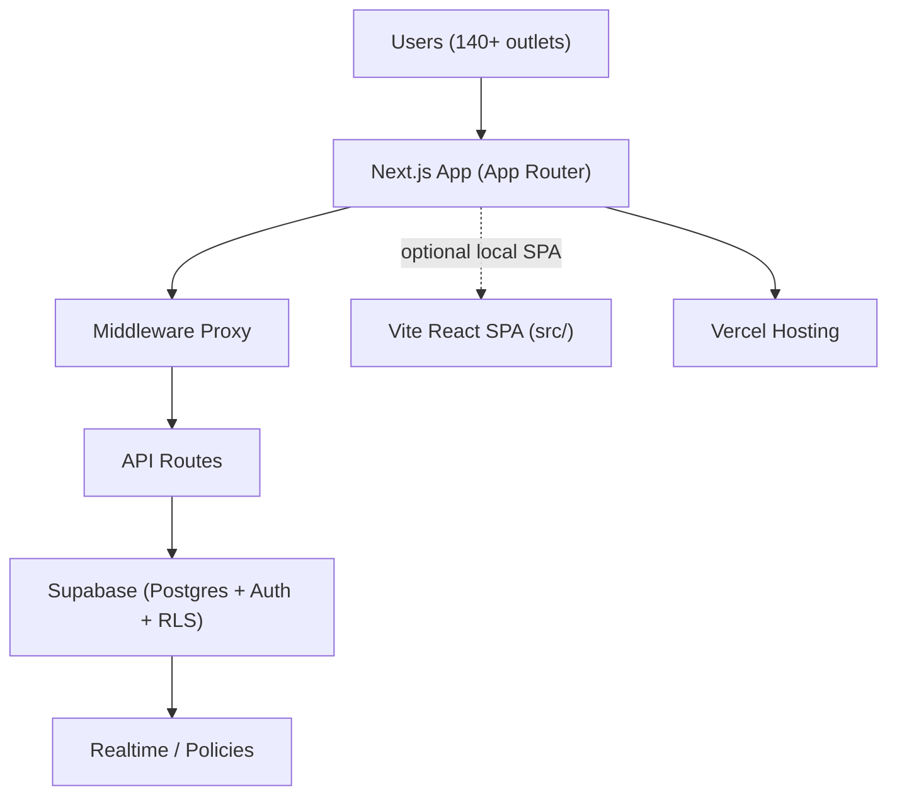
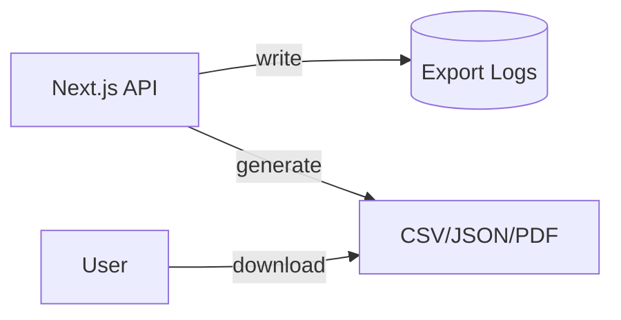

# Sahakar Accounts


Enterprise-grade accounting system for HyperPharmacy & SmartClinic networks. Secure, scalable, multi-tenant web application designed to replace manual spreadsheet workflows with a robust role-based digital system.

## Highlights

- Production-ready: security audit passed, rate limiting, input validation, idempotency, timezone handling, error sanitization
- Next.js App Router for SSR, serverless API routes, and edge-optimized middleware
- Supabase (PostgreSQL + Auth + Realtime) with RLS policies
- Two runtimes in one repo: the production Next.js app and a Vite SPA for fast local workflows

## Architecture



### Request Flow

```mermaid
sequenceDiagram
    participant U as "User"
    participant P as "Proxy (middleware)"
    participant API as "API Route"
    participant S as "Supabase"
    U->>P: Request /dashboard
    P->>S: supabase.auth.getUser()
    alt authenticated
        P->>API: Forward request
        API->>S: Query with RLS
        S-->>API: Data
        API-->>U: 200 OK
    else unauthenticated
        P-->>U: 307 Redirect to /login
    end
```



### Export & Logs



### RBAC Overview


## Tech Stack

- Frameworks: Next.js ^16 (App Router), React 18, Vite ^6 (SPA)
- Styling: TailwindCSS, shadcn/ui
- Data: Supabase (Postgres + Auth + RLS), React Query
- Validation: Zod
- Charts: Chart.js + react-chartjs-2
- Storage: IndexedDB (Dexie/idb) for drafts
- PWA: Workbox

## Repository Layout

- App (Next.js): [app](file:///d:/K4NN4N/sahakar-accounts/app)
- APIs: [app/api](file:///d:/K4NN4N/sahakar-accounts/app/api)
- Middleware proxy: [proxy.ts](file:///d:/K4NN4N/sahakar-accounts/proxy.ts)
- Components: [components](file:///d:/K4NN4N/sahakar-accounts/components)
- Libraries: [lib](file:///d:/K4NN4N/sahakar-accounts/lib)
- Hooks: [hooks](file:///d:/K4NN4N/sahakar-accounts/hooks)
- Supabase migrations: [supabase/migrations](file:///d:/K4NN4N/sahakar-accounts/supabase/migrations)
- Database SQL and docs: [database](file:///d:/K4NN4N/sahakar-accounts/database)
- SPA (Vite): [src](file:///d:/K4NN4N/sahakar-accounts/src)

## Environment

Create `.env` with the following (no secrets in repo):

```bash
# Next.js + Supabase
NEXT_PUBLIC_SUPABASE_URL=your_supabase_project_url
NEXT_PUBLIC_SUPABASE_ANON_KEY=your_supabase_anon_key
SUPABASE_SERVICE_ROLE_KEY=your_service_role_key

# Optional flags
NEXT_PUBLIC_DEV_AUTH=false
NEXT_PUBLIC_ALLOW_FORCE_LOGIN=false
```

## Scripts

- Dev (Vite SPA): `npm run dev`
- Build (Vite SPA): `npm run build`
- Preview (Vite SPA): `npm run preview`
- Next dev: `npm run next:dev`
- Next build: `npm run next:build`
- Next start: `npm run next:start`
- Lint: `npm run lint`
- Type-check: `npm run check`
- Tests (Vitest): `npm run test`

## Supabase Setup

- Create a Supabase project and obtain URL/keys
- Apply migrations in [supabase/migrations](file:///d:/K4NN4N/sahakar-accounts/supabase/migrations)
- RLS and policies included via migrations and SQL under [database](file:///d:/K4NN4N/sahakar-accounts/database)

## Security & Middleware

- Proxy handler enforces:
  - Rate limiting on `/api/*` with stricter limits for mutating routes and login
  - DEV_AUTH production safeguard
  - Secure auth via `supabase.auth.getUser()` (avoids insecure cookie reads)
  - Auditor read-only enforcement
  - Dashboard page view audit logging
  - See [proxy.ts](file:///d:/K4NN4N/sahakar-accounts/proxy.ts)

## API Overview (selected)

- Admin: `/api/admin/*`
- Anomalies: `/api/anomalies`, `/api/anomalies/stats`, `/api/anomalies/export`
- Audit logs: `/api/audit-logs`, `/api/audit/log`
- Daily records: `/api/daily-records/*`
- Reports: `/api/reports/*`
- Transactions: `/api/transactions/*`
- Users & Staff: `/api/users/*`
- Profiles: `/api/profile`

### Export Logs API

- `GET /api/anomalies/export?limit=10`
  - Returns recent export logs for the authenticated user: `{ exports: [...] }`
  - Role-based access: `superadmin`, `master_admin`, `ho_accountant`, `auditor`
  - Query params: `limit` (default 10)

- `POST /api/anomalies/export`
  - Starts an export job and creates an `export_logs` entry
  - Body: `{ format: 'csv' | 'json' | 'pdf', filters?: { date_range?: '1d'|'7d'|'30d'|'90d'|'1y', severity?: 'critical'|'warning'|'info'|'all', outlet_id?: string } }`
  - Response: `{ export_id, status: 'processing' }`

- `POST /api/export-log`
  - Records an explicit export log entry (for custom reports)
  - Body: `{ export_type: 'pdf'|'excel', report_type: string, file_hash: string(64), record_count: number, filters?: object }`
  - Response: `{ success: true, id }`

## Roles

- Superadmin: full governance and audit trail access
- HO Accountant: monitor and lock/verify daily records (time window)
- Manager: outlet operations and approvals
- Staff: data entry only
- Auditor: read-only; blocked from writes by proxy

## Offline & PWA

- Draft-only offline mode to preserve accounting integrity
- IndexedDB-backed drafts, explicit submission when online
- Workbox caching for assets; installable PWA

## Testing & Linting

- ESLint flat config across TS/TSX: [eslint.config.js](file:///d:/K4NN4N/sahakar-accounts/eslint.config.js)
- TypeScript build checks: `npm run check`
- Vitest for component tests; currently configured to pass without SPA tests pending stabilization

## Deployment (Vercel)

- Git push to `main` triggers build and deploy
- Ensure environment variables set in Vercel project
- Large build artifacts are ignored (`.next/` not tracked)

## Troubleshooting

- Insecure user warning: switch to `supabase.auth.getUser()` (already implemented)
- Cookie API errors: use Next 16 `cookies` correct signatures (already implemented)
- Supabase connection: verify env vars and project settings

## License

MIT License

## Acknowledgments

- Supabase, Next.js, TailwindCSS, shadcn/ui, React Query, Chart.js ecosystem
