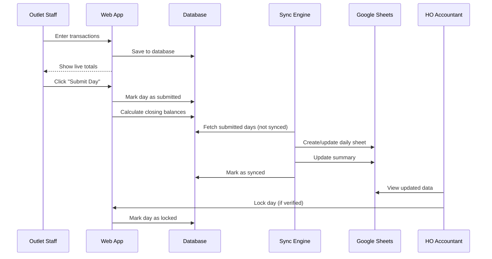

# Sahakar Accounts - Complete Action Plan & Technical Specification

## 📋 Executive Summary

**Project**: Sahakar Accounts Web Application  
**Purpose**: Multi-tenant accounting system for 140+ hyperpharmacies with in-app export logs  
**Current State**: Manual Excel-based accounting (10 outlets)  
**Target State**: Scalable web application with role-based access, automated reporting (exports + logs), and HO monitoring  
**Timeline**: Implementation in phases (detailed below)

---

## 🎯 Core Objectives

1. **Replace manual Excel data entry** with a structured web application
2. **Provide in-app export logs** as the reporting layer for HO accountants
3. **Support 140+ outlets** with multi-tenant architecture
4. **Implement role-based access control** (Master Admin, HO Accountant, Outlet Manager, Outlet Staff)
5. **Automate reconciliation** and daily closing processes
6. **Ensure data integrity** with validation and audit trails

---

## 📊 System Architecture

### High-Level Architecture

```
┌─────────────────┐      ┌──────────────────┐      ┌─────────────────────┐
│  Outlet Users   │─────▶│   Web App        │─────▶│  Primary Database   │
│  (140+ outlets) │      │  (Next.js)       │      │  (Supabase/Postgres)│
└─────────────────┘      └──────────────────┘      └─────────────────────┘
                                  │                           │
                                  │                           │
                                  ▼                           ▼
                         ┌──────────────────┐      ┌─────────────────────┐
                         │  Export Engine   │─────▶│  Export Logs        │
                         │  (Background Job)│      │  (Per Outlet)       │
                         └──────────────────┘      └─────────────────────┘
                                                              │
                                                              ▼
                                                    ┌─────────────────────┐
                                                    │  HO Accountant      │
                                                    │  (Read-only)        │
                                                    └─────────────────────┘
```

### Technology Stack

#### Frontend
- **Framework**: Next.js 14+ (App Router)
- **UI Library**: React 18+
- **Styling**: TailwindCSS
- **Components**: shadcn/ui
- **State Management**: React Query + Zustand
- **Forms**: React Hook Form + Zod validation
- **Date Handling**: date-fns

#### Backend
- **API**: Next.js API Routes
- **Database**: Supabase (PostgreSQL)
- **Authentication**: Supabase Auth
- **ORM**: Prisma or Drizzle
- **File Storage**: Supabase Storage (for exports)

#### Integration Layer
- **Google Sheets API**: googleapis package
- **Background Jobs**: Vercel Cron Jobs
- **Excel Export**: exceljs package
- **PDF Export**: jsPDF or Puppeteer

#### DevOps
- **Hosting**: Vercel
- **Database**: Supabase Cloud
- **Monitoring**: Vercel Analytics + Sentry
- **Version Control**: Git/GitHub

---

## 🗄️ Database Schema

### Core Tables

#### 1. **organizations**
Multi-tenant root table for the organization.

```sql
CREATE TABLE organizations (
  id UUID PRIMARY KEY DEFAULT gen_random_uuid(),
  name VARCHAR(255) NOT NULL,
  code VARCHAR(50) UNIQUE NOT NULL,
  timezone VARCHAR(50) DEFAULT 'Asia/Kolkata',
  locale VARCHAR(10) DEFAULT 'en-IN',
  currency VARCHAR(3) DEFAULT 'INR',
  created_at TIMESTAMPTZ DEFAULT NOW(),
  updated_at TIMESTAMPTZ DEFAULT NOW()
);
```

#### 2. **outlets**
Individual hyperpharmacy locations.

```sql
CREATE TABLE outlets (
  id UUID PRIMARY KEY DEFAULT gen_random_uuid(),
  organization_id UUID NOT NULL REFERENCES organizations(id) ON DELETE CASCADE,
  name VARCHAR(255) NOT NULL,
  code VARCHAR(50) NOT NULL,
  location VARCHAR(255),
  phone VARCHAR(20),
  email VARCHAR(255),
  -- removed external sheet id; reporting via export logs
  is_active BOOLEAN DEFAULT true,
  created_at TIMESTAMPTZ DEFAULT NOW(),
  updated_at TIMESTAMPTZ DEFAULT NOW(),
  UNIQUE(organization_id, code)
);
```

#### 3. **users**
System users with role-based access.

```sql
CREATE TABLE users (
  id UUID PRIMARY KEY REFERENCES auth.users(id) ON DELETE CASCADE,
  organization_id UUID NOT NULL REFERENCES organizations(id) ON DELETE CASCADE,
  email VARCHAR(255) UNIQUE NOT NULL,
  full_name VARCHAR(255) NOT NULL,
  role VARCHAR(50) NOT NULL, -- 'master_admin', 'ho_accountant', 'outlet_manager', 'outlet_staff'
  phone VARCHAR(20),
  is_active BOOLEAN DEFAULT true,
  created_at TIMESTAMPTZ DEFAULT NOW(),
  updated_at TIMESTAMPTZ DEFAULT NOW()
);
```

#### 4. **user_outlet_access**
Many-to-many mapping for user outlet access.

```sql
CREATE TABLE user_outlet_access (
  id UUID PRIMARY KEY DEFAULT gen_random_uuid(),
  user_id UUID NOT NULL REFERENCES users(id) ON DELETE CASCADE,
  outlet_id UUID NOT NULL REFERENCES outlets(id) ON DELETE CASCADE,
  created_at TIMESTAMPTZ DEFAULT NOW(),
  UNIQUE(user_id, outlet_id)
);
```

#### 5. **daily_records**
Daily accounting day records for each outlet.

```sql
CREATE TABLE daily_records (
  id UUID PRIMARY KEY DEFAULT gen_random_uuid(),
  outlet_id UUID NOT NULL REFERENCES outlets(id) ON DELETE CASCADE,
  date DATE NOT NULL,
  opening_cash DECIMAL(12, 2) DEFAULT 0,
  opening_upi DECIMAL(12, 2) DEFAULT 0,
  closing_cash DECIMAL(12, 2) DEFAULT 0,
  closing_upi DECIMAL(12, 2) DEFAULT 0,
  total_income DECIMAL(12, 2) DEFAULT 0,
  total_expense DECIMAL(12, 2) DEFAULT 0,
  status VARCHAR(20) DEFAULT 'draft', -- 'draft', 'submitted', 'locked'
  submitted_at TIMESTAMPTZ,
  submitted_by UUID REFERENCES users(id),
  locked_at TIMESTAMPTZ,
  locked_by UUID REFERENCES users(id),
  synced_to_sheet BOOLEAN DEFAULT false,
  last_synced_at TIMESTAMPTZ,
  created_at TIMESTAMPTZ DEFAULT NOW(),
  updated_at TIMESTAMPTZ DEFAULT NOW(),
  UNIQUE(outlet_id, date)
);

CREATE INDEX idx_daily_records_outlet_date ON daily_records(outlet_id, date);
CREATE INDEX idx_daily_records_status ON daily_records(status);
```

#### 6. **transactions**
Individual income/expense transactions.

```sql
CREATE TABLE transactions (
  id UUID PRIMARY KEY DEFAULT gen_random_uuid(),
  daily_record_id UUID NOT NULL REFERENCES daily_records(id) ON DELETE CASCADE,
  type VARCHAR(20) NOT NULL, -- 'income', 'expense'
  category VARCHAR(100) NOT NULL, -- 'consultation', 'medicine', 'staff_salary', 'transport', etc.
  payment_mode VARCHAR(20) NOT NULL, -- 'cash', 'upi'
  amount DECIMAL(12, 2) NOT NULL CHECK (amount >= 0),
  description TEXT,
  created_by UUID REFERENCES users(id),
  created_at TIMESTAMPTZ DEFAULT NOW(),
  updated_at TIMESTAMPTZ DEFAULT NOW()
);

CREATE INDEX idx_transactions_daily_record ON transactions(daily_record_id);
CREATE INDEX idx_transactions_type ON transactions(type);
CREATE INDEX idx_transactions_category ON transactions(category);
```

#### 7. **monthly_summaries**
Aggregated monthly reports.

```sql
CREATE TABLE monthly_summaries (
  id UUID PRIMARY KEY DEFAULT gen_random_uuid(),
  outlet_id UUID NOT NULL REFERENCES outlets(id) ON DELETE CASCADE,
  month DATE NOT NULL, -- First day of the month
  total_income DECIMAL(12, 2) DEFAULT 0,
  total_expense DECIMAL(12, 2) DEFAULT 0,
  total_cash_in DECIMAL(12, 2) DEFAULT 0,
  total_cash_out DECIMAL(12, 2) DEFAULT 0,
  total_upi_in DECIMAL(12, 2) DEFAULT 0,
  total_upi_out DECIMAL(12, 2) DEFAULT 0,
  net_profit DECIMAL(12, 2) DEFAULT 0,
  opening_balance DECIMAL(12, 2) DEFAULT 0,
  closing_balance DECIMAL(12, 2) DEFAULT 0,
  days_count INTEGER DEFAULT 0,
  generated_at TIMESTAMPTZ DEFAULT NOW(),
  UNIQUE(outlet_id, month)
);

CREATE INDEX idx_monthly_summaries_outlet_month ON monthly_summaries(outlet_id, month);
```

#### 8. **categories**
Predefined transaction categories.

```sql
CREATE TABLE categories (
  id UUID PRIMARY KEY DEFAULT gen_random_uuid(),
  organization_id UUID NOT NULL REFERENCES organizations(id) ON DELETE CASCADE,
  name VARCHAR(100) NOT NULL,
  type VARCHAR(20) NOT NULL, -- 'income', 'expense'
  code VARCHAR(50) NOT NULL,
  is_active BOOLEAN DEFAULT true,
  created_at TIMESTAMPTZ DEFAULT NOW(),
  UNIQUE(organization_id, code)
);

-- Seed default categories
INSERT INTO categories (organization_id, name, type, code) VALUES
  ((SELECT id FROM organizations LIMIT 1), 'Consultation', 'income', 'consultation'),
  ((SELECT id FROM organizations LIMIT 1), 'Medicine Sale', 'income', 'medicine_sale'),
  ((SELECT id FROM organizations LIMIT 1), 'Other Income', 'income', 'other_income'),
  ((SELECT id FROM organizations LIMIT 1), 'Medicine Purchase', 'expense', 'medicine_purchase'),
  ((SELECT id FROM organizations LIMIT 1), 'Staff Salary', 'expense', 'staff_salary'),
  ((SELECT id FROM organizations LIMIT 1), 'Clinic Expenses', 'expense', 'clinic_expenses'),
  ((SELECT id FROM organizations LIMIT 1), 'Transport', 'expense', 'transport'),
  ((SELECT id FROM organizations LIMIT 1), 'Miscellaneous', 'expense', 'miscellaneous');
```

#### 9. **audit_logs**
Activity tracking for compliance.

```sql
CREATE TABLE audit_logs (
  id UUID PRIMARY KEY DEFAULT gen_random_uuid(),
  user_id UUID REFERENCES users(id),
  outlet_id UUID REFERENCES outlets(id),
  action VARCHAR(100) NOT NULL,
  entity_type VARCHAR(50),
  entity_id UUID,
  details JSONB,
  ip_address INET,
  user_agent TEXT,
  created_at TIMESTAMPTZ DEFAULT NOW()
);

CREATE INDEX idx_audit_logs_user ON audit_logs(user_id);
CREATE INDEX idx_audit_logs_outlet ON audit_logs(outlet_id);
CREATE INDEX idx_audit_logs_created_at ON audit_logs(created_at);
```

### Row-Level Security (RLS) Policies

```sql
-- Enable RLS on all tables
ALTER TABLE outlets ENABLE ROW LEVEL SECURITY;
ALTER TABLE users ENABLE ROW LEVEL SECURITY;
ALTER TABLE user_outlet_access ENABLE ROW LEVEL SECURITY;
ALTER TABLE daily_records ENABLE ROW LEVEL SECURITY;
ALTER TABLE transactions ENABLE ROW LEVEL SECURITY;
ALTER TABLE monthly_summaries ENABLE ROW LEVEL SECURITY;

-- Outlets: Users can only see outlets they have access to
CREATE POLICY outlets_access ON outlets
  FOR SELECT
  USING (
    EXISTS (
      SELECT 1 FROM user_outlet_access uoa
      JOIN users u ON u.id = uoa.user_id
      WHERE uoa.outlet_id = outlets.id
        AND u.id = auth.uid()
    )
    OR
    EXISTS (
      SELECT 1 FROM users u
      WHERE u.id = auth.uid()
        AND u.role IN ('master_admin', 'ho_accountant')
    )
  );

-- Daily Records: Based on outlet access
CREATE POLICY daily_records_access ON daily_records
  FOR SELECT
  USING (
    EXISTS (
      SELECT 1 FROM user_outlet_access uoa
      JOIN users u ON u.id = uoa.user_id
      WHERE uoa.outlet_id = daily_records.outlet_id
        AND u.id = auth.uid()
    )
    OR
    EXISTS (
      SELECT 1 FROM users u
      WHERE u.id = auth.uid()
        AND u.role IN ('master_admin', 'ho_accountant')
    )
  );

-- Transactions: Based on daily record access
CREATE POLICY transactions_access ON transactions
  FOR SELECT
  USING (
    EXISTS (
      SELECT 1 FROM daily_records dr
      WHERE dr.id = transactions.daily_record_id
        AND (
          EXISTS (
            SELECT 1 FROM user_outlet_access uoa
            JOIN users u ON u.id = uoa.user_id
            WHERE uoa.outlet_id = dr.outlet_id
              AND u.id = auth.uid()
          )
          OR
          EXISTS (
            SELECT 1 FROM users u
            WHERE u.id = auth.uid()
              AND u.role IN ('master_admin', 'ho_accountant')
          )
        )
    )
  );
```

---

## 👥 Role-Based Access Control

### Role Definitions

#### 1. **Master Admin**
- **Access**: Full system access
- **Permissions**:
  - Create/edit/delete organizations
  - Create/edit/delete outlets
  - Create/edit/delete users
  - Assign user roles
  - View all data across all outlets
  - Lock/unlock any day
  - Configure system settings

#### 2. **HO Accountant**
- **Access**: Read-only across all outlets
- **Permissions**:
  - View all outlet data
  - View all transactions
  - Lock/unlock days (after verification)
  - Flag discrepancies
  - Export reports
  - Access Google Sheets (read-only recommendation)

#### 3. **Outlet Manager**
- **Access**: Full access to assigned outlet(s)
- **Permissions**:
  - View outlet data
  - Create/edit daily entries (until locked)
  - Add/edit transactions (until submitted)
  - Submit daily entries
  - View reports for their outlet
  - Manage outlet staff users (create/deactivate)

#### 4. **Outlet Staff**
- **Access**: Limited to data entry for assigned outlet(s)
- **Permissions**:
  - Add transactions (today only)
  - View their own entries
  - Cannot edit after submission
  - Cannot view historical data beyond current month

---

## 🔄 Data Flow & Sync Strategy

### Daily Entry Workflow



### Google Sheets Sync Strategy

#### Sync Trigger
- **Frequency**: Every 15 minutes (Vercel Cron Job)
- **Condition**: Only sync submitted and unlocked days
- **Batch**: Process up to 50 records per run

#### Sync Process
1. **Query**: Fetch all daily_records with `status = 'submitted' AND synced_to_sheet = false`
2. **Create Sheet**: If daily sheet doesn't exist, create it from template
3. **Write Data**: 
   - Batch write all transactions to the daily sheet
   - Update opening/closing balances
   - Recalculate summary cells
4. **Update Summary**: Aggregate monthly totals
5. **Mark Synced**: Set `synced_to_sheet = true` and `last_synced_at = NOW()`

#### File Structure
```
/Hyperpharmacy Accounts/
  ├── MELATTUR.xlsx
  │   ├── TEMPLATE (hidden)
  │   ├── 011125 (Nov 1, 2025)
  │   ├── 021125 (Nov 2, 2025)
  │   ├── ...
  │   ├── 301125 (Nov 30, 2025)
  │   ├── Summary
  │   └── Meta
  ├── PERINTHALMANNA.xlsx
  ├── MANJERI.xlsx
  └── ... (140+ files at scale)
```

#### Performance Optimization
- **Batch API calls**: Use Google Sheets batchUpdate API
- **Caching**: Cache sheet metadata (sheet IDs, ranges)
- **Rate limiting**: Respect Google API quotas (write limit: 100/min)
- **Retry logic**: Exponential backoff for failed syncs
- **Error handling**: Log failures, retry on next cron run

---

## 🎨 User Interface Design

### Page Structure

#### 1. **Authentication Pages**
- Login (email + password)
- Password reset
- First-time setup

#### 2. **Dashboard** (role-based)
- **Master Admin**: Overview of all outlets, system health
- **HO Accountant**: Pending submissions, discrepancies, summary stats
- **Outlet Manager**: Daily entry status, monthly summary
- **Outlet Staff**: Quick entry form

#### 3. **Outlet Management** (Master Admin only)
- List outlets
- Create outlet
- Edit outlet details
- Assign users
- Configure Google Sheet connection

#### 4. **Daily Entry Screen**
- Date picker (defaults to today)
- Opening balances (auto-filled from previous day)
- Transaction entry form:
  - Type (Income/Expense)
  - Category (dropdown)
  - Payment mode (Cash/UPI)
  - Amount (number input)
  - Description (optional)
- Live totals display:
  - Total Cash In / Out
  - Total UPI In / Out
  - Closing Cash Balance
  - Closing UPI Balance
- Actions:
  - Save draft
  - Submit day
  - Print/Export

#### 5. **Monthly View**
- Calendar view with daily summary cards
- Monthly totals chart
- Export month report (Excel/PDF)

#### 6. **Reports**
- Date range selector
- Filters: outlet, category, payment mode
- Charts: income vs expense, cash vs UPI
- Export options

#### 7. **User Management** (Master Admin & Outlet Manager)
- List users
- Create user
- Assign roles
- Manage outlet access

### UI Components (shadcn/ui)

- **Forms**: Input, Select, Textarea, DatePicker
- **Data Display**: Table, Card, Badge
- **Feedback**: Toast, Alert, Dialog
- **Navigation**: Sidebar, Breadcrumb, Tabs
- **Charts**: Recharts (simple bar/line charts)

---

## 🔐 Security & Validation

### Data Validation Rules

#### Daily Entry
- **Date**: Cannot be future date
- **Opening balances**: Must match previous day's closing (if exists)
- **Amount**: Must be positive number
- **Category**: Must be from predefined list
- **Payment mode**: Must be 'cash' or 'upi'
- **Transactions**: At least one transaction required to submit

#### Business Rules
- **Lock after submission**: HO Accountant can lock a day after verification
- **No edits after lock**: Locked days cannot be modified
- **Sequential entry**: Warn if entering data for day X when day X-1 is not submitted
- **Balance validation**: Closing balance = Opening + Income - Expense

### Security Measures

1. **Authentication**: Supabase Auth with JWT
2. **Authorization**: RLS policies enforce access control
3. **Input sanitization**: Zod schema validation
4. **SQL injection prevention**: Parameterized queries only
5. **XSS prevention**: React auto-escaping + CSP headers
6. **Rate limiting**: API route rate limiting
7. **Audit trail**: Log all data modifications
8. **HTTPS only**: Enforce SSL in production

---

## 📦 Implementation Plan

### Phase 1: Foundation (Week 1)
- [ ] Initialize Next.js project
- [ ] Set up Supabase project
- [ ] Create database schema
- [ ] Implement authentication
- [ ] Set up basic project structure
- [ ] Configure TailwindCSS + shadcn/ui

### Phase 2: Core Features (Week 2-3)
- [ ] Outlet management (Admin)
- [ ] User management (Admin)
- [ ] Daily entry form
- [ ] Transaction CRUD
- [ ] Opening/closing balance calculation
- [ ] Submit day functionality

### Phase 3: Google Sheets Integration (Week 3-4)
- [ ] Google API setup
- [ ] Sync engine implementation
- [ ] Template sheet creation
- [ ] Batch write logic
- [ ] Error handling & retry logic
- [ ] Cron job setup

### Phase 4: Advanced Features (Week 4-5)
- [ ] Monthly summary aggregation
- [ ] Reports & charts
- [ ] Excel/PDF export
- [ ] Lock/unlock days (HO)
- [ ] Audit logs
- [ ] Activity notifications

### Phase 5: Testing & Polish (Week 5-6)
- [ ] Unit tests
- [ ] Integration tests
- [ ] End-to-end tests
- [ ] Performance optimization
- [ ] Mobile responsiveness
- [ ] Accessibility audit

### Phase 6: Deployment (Week 6)
- [ ] Vercel deployment
- [ ] Environment configuration
- [ ] Database migration scripts
- [ ] User onboarding documentation
- [ ] Production monitoring setup

---

## 📱 Mobile Considerations

While this is a web application, ensure mobile-friendly design:
- Responsive layout (mobile-first approach)
- Touch-friendly buttons (min 44px)
- Simplified navigation on mobile
- Progressive Web App (PWA) - installable
- Offline support for draft entries (IndexedDB)

---

## 🚀 Future Enhancements

### Short-term (3-6 months)
- [ ] WhatsApp/Email daily summary notifications
- [ ] Bulk transaction import (CSV)
- [ ] Advanced analytics dashboard
- [ ] Invoice/bill generation
- [ ] Inventory tracking integration

### Long-term (6-12 months)
- [ ] Mobile app (React Native)
- [ ] Multi-currency support
- [ ] Advanced reporting (Power BI integration)
- [ ] AI-powered expense categorization
- [ ] Integration with accounting software (Tally, QuickBooks)

---

## 📈 Scalability & Performance

### Database Optimization
- Indexed columns for frequent queries
- Partitioning for large tables (by month/year)
- Connection pooling (Supabase manages this)
- Query optimization (use EXPLAIN ANALYZE)

### Application Performance
- Server-side rendering (Next.js)
- API route caching
- Static generation for public pages
- Image optimization (next/image)
- Code splitting & lazy loading

### Google Sheets Performance
- Batch writes (100 rows at a time)
- Rate limiting (respect API quotas)
- Caching (sheet metadata, template structure)
- Parallel processing (multiple outlets concurrently)
- Fallback: If Sheets API fails, store in DB and retry

---

## 🛠️ Development Environment Setup

### Prerequisites
- Node.js 18+ & npm/yarn
- Git
- VS Code (recommended)
- Supabase account
- Google Cloud account (for Sheets API)

### Environment Variables
```env
# Supabase
NEXT_PUBLIC_SUPABASE_URL=
NEXT_PUBLIC_SUPABASE_ANON_KEY=
SUPABASE_SERVICE_ROLE_KEY=

# Google Sheets API
GOOGLE_SHEETS_API_KEY=
GOOGLE_SHEETS_CLIENT_EMAIL=
GOOGLE_SHEETS_PRIVATE_KEY=

# App Config
NEXT_PUBLIC_APP_URL=
CRON_SECRET= # For securing cron endpoints
```

### Initial Setup Commands
```bash
# Clone repository
git clone <repo-url>
cd sahakar-accounts

# Install dependencies
npm install

# Set up environment variables
cp .env.example .env.local
# Edit .env.local with your credentials

# Run database migrations
npm run db:migrate

# Seed initial data
npm run db:seed

# Start development server
npm run dev
```

---

## 📚 Documentation

### User Documentation
- Admin guide (outlet setup, user management)
- HO Accountant guide (monitoring, locking, exports)
- Outlet Manager guide (daily entries, reports)
- Outlet Staff guide (transaction entry)

### Developer Documentation
- API reference
- Database schema
- Sync engine logic
- Deployment guide
- Troubleshooting guide

---

## 🎓 Best Practices

### Code Quality
- TypeScript for type safety
- ESLint + Prettier for code formatting
- Conventional commits for Git messages
- Code reviews before merging
- Write tests for critical paths

### Database
- Use transactions for multi-table operations
- Never expose service role key in frontend
- Regular backups (Supabase handles this)
- Monitor query performance

### Security
- Never trust user input
- Validate on both client and server
- Use RLS for all tables
- Regular security audits
- Keep dependencies updated

---

## 🐛 Error Handling

### Frontend
- User-friendly error messages
- Toast notifications for actions
- Validation errors inline
- Network error fallback UI

### Backend
- Structured error responses
- Error logging (Sentry)
- Graceful degradation
- Retry logic for transient failures

### Google Sheets Sync
- Log all sync attempts
- Retry failed syncs (max 3 attempts)
- Alert admin on persistent failures
- Maintain sync status in database

---

## 📊 Monitoring & Analytics

### Application Monitoring
- Vercel Analytics (page views, performance)
- Sentry (error tracking)
- Supabase dashboard (DB performance)
- Custom metrics (daily entries, sync success rate)

### Business Metrics
- Daily active users
- Entries per outlet per day
- Sync success rate
- Average entry time
- User adoption rate

---

## ✅ Success Criteria

1. **100% data accuracy**: No discrepancies between app and sheets
2. **99.9% uptime**: Minimal downtime
3. **< 2 seconds page load**: Fast user experience
4. **Zero data loss**: Robust sync with retry logic
5. **User adoption**: 90%+ of outlets using the system within 3 months

---

## 📞 Support & Maintenance

### Support Channels
- Email: support@sahakar-accounts.com
- In-app chat widget
- User documentation portal
- Admin helpdesk (for technical issues)

### Maintenance Plan
- **Weekly**: Review error logs, sync failures
- **Monthly**: DB performance review, update dependencies
- **Quarterly**: Security audit, user feedback review
- **Annually**: Major feature releases

---

## 🗓️ Rollout Strategy

### Pilot Phase (1-2 weeks)
- Deploy to 2-3 pilot outlets
- Train users
- Gather feedback
- Fix critical issues

### Gradual Rollout (4-6 weeks)
- Add 10 outlets per week
- Provide training sessions
- Monitor performance
- Address issues promptly

### Full Deployment (Week 6+)
- Deploy to all 140+ outlets
- Ongoing support
- Continuous improvement

---

## 🎉 Conclusion

This action plan provides a comprehensive blueprint for building the Sahakar Accounts web application. The system is designed to be:

- **Scalable**: Handle 140+ outlets and beyond
- **Reliable**: Data integrity with automated reconciliation
- **User-friendly**: Simple interfaces for each role
- **Maintainable**: Clean architecture with good documentation
- **Secure**: Role-based access with audit trails

**Next Steps**:
1. Review and approve this plan
2. Set up development environment
3. Begin Phase 1 implementation
4. Regular progress reviews

Let's build this! 🚀
